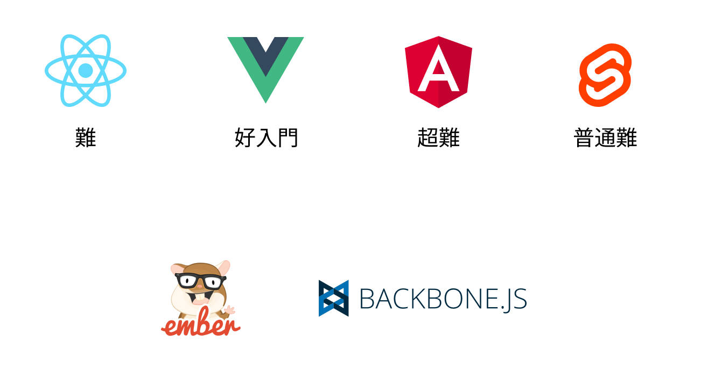
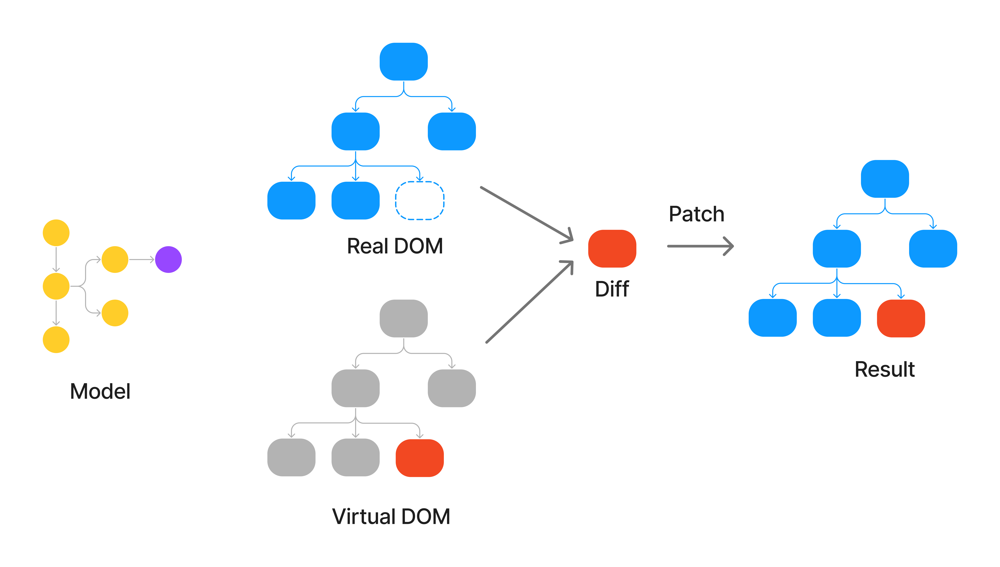

# 可愛萌新學Vue

## 前端框架


## 特色

  ### 資料響應

  ### 模組化(component)
  

  ### 聲明式編程(Declarative Programming)

命令
```javascript
   let arr = [1,2,3,4,5,6]
   let result = []

   for(let i = 0; i < arr.length; i++) {
     result[i] = arr[i] * 2
   }
   // result log -> [2,4,6,8,10,12]

```

聲明
```javascript
  let arr = [1,2,3,4,5,6]
  let result = arr.map(n => n * 2)
  // result log -> [2,4,6,8,10,12]

```

[渲染列表範例](https://codepen.io/erichuang80s/pen/vYvyKBr)

## 渲染機制
  

## 基礎起手式

CDN安裝

```html
  <!DOCTYPE html>
  <html lang="en">
    <head>
      <meta charset="UTF-8">
      <meta name="viewport" content="width=device-width, initial-scale=1.0">
      <script src="https://unpkg.com/vue@3/dist/vue.global.js"></script>
      <title>Document</title>
    </head>
    <body>
      <div id="app"></div>
    </body>
    <script>
      const {createApp} = Vue
      const app = createApp({
        data() {
          return {
            text: 'hello vue'
          }
        }
      })
      app.mount('#app')
    </script>    
  </html>
```

> ❌永遠不要使用 body  作為 根節點，因為根節點是需多第三方插件會從body 注入DOM，會使你的DOM Tree 毀損，所以要自己建立的DOM作為根節點渲染。

## 範例練習
[模板語法](https://cn.vuejs.org/guide/essentials/template-syntax.html)
[響應式基礎](https://cn.vuejs.org/guide/essentials/reactivity-fundamentals.html)
[Class 與 Style 綁定](https://cn.vuejs.org/guide/essentials/class-and-style.html)
[計算屬性](https://cn.vuejs.org/guide/essentials/computed.html)
[條件渲染](https://cn.vuejs.org/guide/essentials/conditional.html)
[列表渲染](https://cn.vuejs.org/guide/essentials/list.html)
[事件處理](https://cn.vuejs.org/guide/essentials/event-handling.html)
[表單輸入綁定](https://cn.vuejs.org/guide/essentials/forms.html)
[生命週期鉤子](https://cn.vuejs.org/guide/essentials/lifecycle.html)

## 範例練習2(example/vue.html)
1. v-if、v-show、v-for、v-bind、computed、mounted
2. array filter、includes、fetch api

## 補充說明

1. 簡略說明非同步
2. fetch api

[圖說](https://www.figma.com/file/iso7wy8xLzaJaPQzpSjpY6/%E8%90%8C%E6%96%B0%E5%AD%B8%E7%BF%92Vue?type=whiteboard&node-id=0%3A1&t=PjdrV2zkV8rtH1Lf-1)
